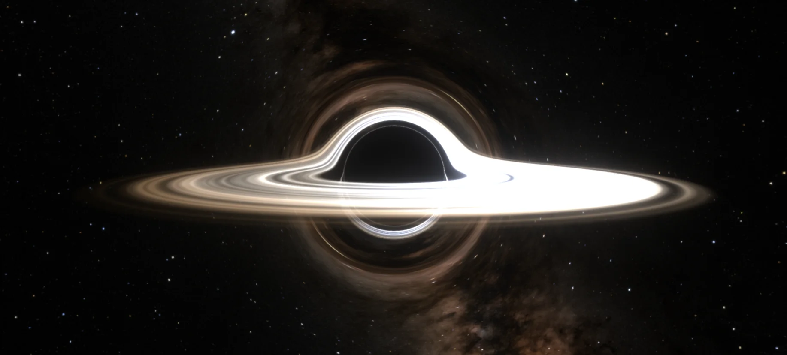

# Schwarzschild Black Hole Lensing Simulation

A real-time gravitational lensing simulation of a Schwarzschild (non-rotating) black hole with an accretion disk, built with Three.js and WebGL2.

[blackhole.zaks.io](https://blackhole.zaks.io) is operated by [Zaks.io](https://zaks.io).



## Features

- **Accurate Gravitational Lensing**: Ray-traced light bending using the Schwarzschild metric geodesic equations
- **Photon Ring**: Higher-order images produced by traced disk-plane crossings, not a painted-on ring
- **Accretion Disk**: Flared, vertically resolved disk with a temperature gradient, a hot corona, and optional relativistic jets
- **Relativistic Effects**: Doppler shift, beaming as the cube of the Doppler factor, and gravitational redshift
- **MHD Turbulence**: Spiral arms and orbiting hotspots baked per frame into a log-polar lookup
- **EHT Mode**: Optional telescope-diffraction blur matched to the 2017 Event Horizon Telescope beam-to-ring ratio
- **Alternate Spacetimes**: Traversable wormhole mode, and a binary system with a circumbinary disk, accretion streams, and gravitational waves
- **HDR Starfield**: 4K equirectangular star maps, with automatic HDR display detection
- **Real-time Performance**: Adaptive ray-march quality based on display resolution
- **Interactive Controls**: Orbit and free-flight cameras, camera presets and sequences, plus a full parameter GUI
- **Offline Rendering**: Frame-by-frame export at higher quality for video

## Quick Start

```bash
# Install dependencies
bun install

# Start development server
bun dev

# Build for production
bun run build
```

Open `http://localhost:3000` in your browser.

## Controls

Orbit mode (default):

- **Left Mouse Drag**: Orbit camera around black hole
- **Scroll Wheel**: Zoom in/out
- **Right Mouse Drag**: Pan camera

Fly mode:

- **Click**: Capture the mouse for direct look control; **Esc** releases it
- **W / A / S / D**: Move along the view direction
- **R / F**: Move vertically

Camera presets are also reachable directly by URL, for example `/photon-sphere`
or `/edge-on`.

### GUI Parameters

A selection; `lib/config.ts` is the source of truth for every parameter and its
current default.

| Parameter            | Description                                   | Default  |
| -------------------- | --------------------------------------------- | -------- |
| Schwarzschild Radius | Size of the event horizon                     | 1.0      |
| Auto Ray Steps       | Automatically scale steps based on resolution | On       |
| Ray March Steps      | Number of integration steps per ray           | 64-200   |
| Inner Radius         | Accretion disk inner edge (ISCO)              | 3.0 rs   |
| Outer Radius         | Accretion disk outer edge                     | 12.0 rs  |
| Inner Temp           | Temperature at disk inner edge                | 10,000 K |
| Outer Temp           | Temperature at disk outer edge                | 3,000 K  |
| Bloom Threshold      | HDR bloom cutoff                              | 0.3      |
| Bloom Strength       | Bloom intensity                               | 1.2      |
| Bloom Radius         | Bloom spread                                  | 0.5      |

## Physics

### Gravitational Lensing

The single black hole and the wormhole's far black hole use the spatial
Schwarzschild null-geodesic equation, with affine energy normalized to one:

```
a_vec = -1.5 * rs * L² * position / r⁵
```

Where:

- `rs` is the Schwarzschild radius (event horizon)
- `L = |position × velocity|` is conserved angular momentum
- `r` is the distance from the black hole center

Velocity Verlet advances the ray without renormalizing its affine velocity.
Local camera directions are converted to affine velocities using the Schwarzschild
lapse. The analytic capture boundary prevents exhausted sampling budgets from
showing sky through the shadow. Binary mode still uses illustrative superposed
deflection fields, not an exact binary spacetime.

The force formulation follows [Belbruno and Pretorius (2011)](https://arxiv.org/abs/1103.0585).

### Accretion Disk

The disk is modeled with:

- **Inner edge** at the Innermost Stable Circular Orbit (ISCO = 3rs)
- **Vertical structure**: a flared scale height with Gaussian falloff, not an infinitely thin plane
- **Keplerian rotation**: coordinate angular frequency Ω = √(GM/r³)
- **Temperature gradient**: Newtonian zero-torque profile, vanishing at the inner edge
- **Blackbody radiation**: Color based on temperature using a precomputed LUT
- **Doppler shift**: Frequency/color shift based on disk velocity relative to observer
- **Relativistic beaming**: bolometric intensity scales as g⁴; observed temperature scales as g
- **Gravitational redshift**: circular-orbit time dilation and the finite static observer's lapse enter g

The eccentric disk and binary emission are approximations. This is not a GRMHD
evolution or a full relativistic thin-disk flux model. See the
[physics review](docs/physics-review.md) for validation and remaining limits.

### Event Horizon

Rays that cross inside the Schwarzschild radius (r < rs) are absorbed and render as pure black, creating the characteristic "shadow" of the black hole.

## Technical Details

### Architecture

```
app/                      # Next.js routes and global styles
components/               # React views and simulation controls
lib/
├── audio/                # Web Audio layers for binary mode
├── camera/               # Orbit and free-flight camera controllers
├── config.ts             # Every tunable simulation parameter
├── display/              # HDR display detection
├── gui/                  # lil-gui dev controls
├── particles/            # Particle system types
├── passes/               # LensingPass, the ray-marching shader pass
├── physics/              # CPU reference physics used to validate the shader
├── presets/              # Camera presets, sequences, starfield backgrounds
├── render/               # Offline frame rendering
├── shaders/              # GLSL entry points and included chunks
├── simulation/           # Renderer, lifecycle, post-processing composition
└── utils/                # Blackbody and noise LUTs, blur, sampling
tests/                    # Physics reference tests
bench/                    # Standalone performance harness
```

### Rendering Pipeline

1. **LensingPass**: Fullscreen shader that traces rays from the camera through each pixel
2. **FXAA**: Anti-aliasing (optional)
3. **UnrealBloomPass**: HDR bloom for the bright accretion disk glow
4. **EHT blur**: Paired separable blur passes simulating telescope diffraction (optional, off by default)

Tone mapping depends on the display: HDR displays receive linear sRGB with no
tone mapping, everything else gets ACES Filmic.

### Performance Optimization

- **Adaptive step count**: Steps scale down as pixel count rises, from 200 at 1080p to 64 at 4K
- **Adaptive step size**: Smaller steps near the black hole for accuracy, larger steps far away, with extra refinement near the photon sphere
- **Early ray termination**: Rays exit the loop when absorbed or escaped
- **No geometry rendering**: Everything computed in the fragment shader
- **Precomputed lookups**: Blackbody colors, noise, and per-frame MHD turbulence come from textures rather than being evaluated per ray step

### Dependencies

- [Three.js](https://threejs.org/) - 3D rendering
- [Next.js](https://nextjs.org/) - Application framework
- [React](https://react.dev/) - User interface
- [GSAP](https://gsap.com/) - Camera and background transitions
- [lil-gui](https://lil-gui.georgealways.com/) - Parameter controls
- [stats.js](https://github.com/mrdoob/stats.js/) - FPS monitoring

For architecture and contribution conventions, see [AGENTS.md](AGENTS.md). For
the physical model and its approximations, see [SPEC.md](SPEC.md).

## Assets

The simulation includes a NASA Deep Star Maps 2020 background and additional backgrounds from
Space Spheremaps. These files have separate source terms and are not covered by the repository's
Apache 2.0 license. See [THIRD_PARTY_ASSETS.md](THIRD_PARTY_ASSETS.md) for the verified sources,
terms, and attribution.

## Browser Support

Requires WebGL2 support:

- Chrome 56+
- Firefox 51+
- Safari 15+
- Edge 79+

## License

The source code is available under the [Apache License 2.0](LICENSE). See [NOTICE](NOTICE) for
copyright and attribution notices. Third-party image assets are excluded; see
[THIRD_PARTY_ASSETS.md](THIRD_PARTY_ASSETS.md).

## References

- [Interstellar Black Hole](https://iopscience.iop.org/article/10.1088/0264-9381/32/6/065001) - Oliver James et al.
- [Gravitational Lensing by Spinning Black Holes](https://arxiv.org/abs/1502.03808)
- [Black Hole Visualization](https://rantonels.github.io/starless/) - rantonels/starless
